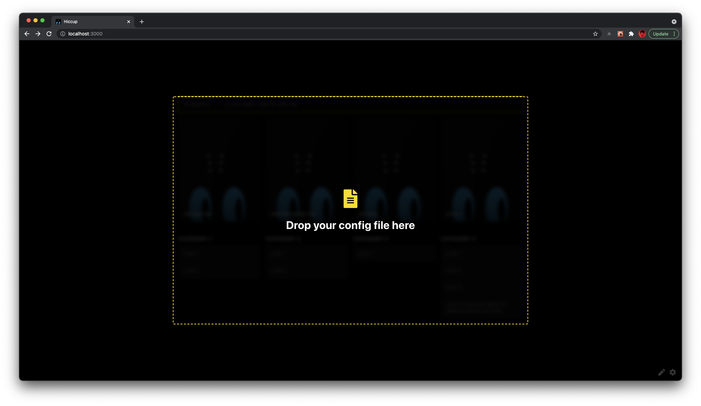

# Hiccup


A static start page to get to your most important links, **FAST**. You can use this for your home server, new tab using browser extentions, use the **demo page** directly or basically anywhere you can server a static webpage from!

### [Live Demo](https://test.designedbyashw.in/hiccup/)

## Features

- Static Webpage
- Featured Links
- Categories
- Quick link preview
- Search (with search provider and tag support)
- Docker support
- Local Config management
- PWA support
- Keyboard shortcuts
- Full keyboard navigation support

## Screens

Landing page


Quickly find links


Easily edit links


Locally manage config using JSON


Drag & drop config file



## Getting started

This project was bootstrapped with [Create React App](https://github.com/facebook/create-react-app). Serve the release build or use any of the available react scripts to run the app.
The startpage uses a `config.json` file as the source of truth for page. It can be modified locally but the result will only be saved on the browsers `localStorage` and persist across sessions.

### Installation

To use the app, you have many options

#### [Hosted site](https://test.designedbyashw.in/hiccup)

I have hosted an instance of the app [here](https://test.designedbyashw.in/hiccup). Since this is a static site, chages you make to the links only exist locally on your browser and are never sent anywhere. To save the links to other browsers, just doenload the config file from the editor using the download button and drag the config file onto a new instance of hiccup on your new browser. The links in your config stay private. You can even have multiple config files that you can load based on your need.

#### Docker

To run the app using docker the image `bleckbeard/hiccup:latest`. You can use the command below or the `docker-compose.yaml` file from the repo. Be sure to change the volume to the location of your local config file. Use the one in `./public/config.json` for reference.

```
docker run \
    -p 8899:80 \
    -v `pwd`/public/config.json:/usr/share/nginx/html/config.json \
    bleckbeard/hiccup:latest
```

#### Using a static site host

You cann download the built file or build it yourself and deploy to a static site provider like netlify or github-pages (or any other way to host a static site). To persist the config, edit the local config file. You can always sync the version of your config file to this using the config editor.

### Hotkeys

The app has a few hotkeys to help you easily navigate around. To quickly view the available hotkeys, use the `Cmd/Ctrl + /` hotkey!

> Note: Hotkeys do not work when the search is bar is in focus. Use `Tab` to focus out of the search bar and into the app or click anywhere outside the search bar to use hotkeys

### Using Search

The purpose of the search is to get to you link as easily as possible.

- Press `UpArrow` and `DownArrow` to navigate the search
- Press `Esc` to quit the search
- Hit `Enter` to open the first highlighted link amongst search results. (Featured cards have a star and the Search provider is marked by a globe)

Search looks at the `name`, `link` and `tags` field of each link in the config to find a match.

### Using Edit mode

The edit mode can be activated using `Cmd/Ctrl + e` or the ✏️ icon on the bottom right of the screen. To exit the edit mode at any time use `Esc` or the commands used to start editing. The Edit mode lets you add, delete and edit links on the startpage.

The feaures currently supported are:

- Add, edit and delete upto 4 featured cards
- Add, edit and delete upto 4 categories
- Add, edit and delete category links

These limits were place intentionally to
For more flexibility, you can directly edit the config using the config editor (described in the next section)

e.g.:

- Remove the category of featured section entirely
- Add more than 4 categories or featured cards

> The `Edit mode` alters the config and if you ever wish to revert to the original config.json file, click the trash icon in the config editor to completely reset the config state.

### Using Config

Since this is a static website, the only way to permanently update the links is to modify the `config.json` file. If using the pre built version, just update the `config.json` file in the release zip. During development, update the config in the `assets` folder since the build will override any other config file.

To update config on a local browser instance, use the online config editor using the ⚙️ icon. This will persist the config across sessions. The local editor allows to:

- Edit the raw local config
- Sync the configuration from `./config.json` file
- Download the latest valid config file
- Upload a local config file. (psst.. if the file has issues, no problem! The editor will still load it and show you the errors until you can save it)
- Save the config to **LocalStorage**

#### Config structure

```js
{
    // featured and catagories are optional sections. Remove them to use the page without it.
    "featured": [{
        "name": "Link name as seen on the card", // required
        "link": "link", // required
        "background": "path to background image", // optional
        "tags": "space spearated tags for searching" //optional
    }, {
        // ... Other featured links
    }],
    "catagories": [{
        "name": "Category name", // required
        "links": [{
            "name": "Link name as seen on the card", // required
            "link": "link", // required
            "tags": "space spearated tags for searching" //optional
        }, {
            // ... Other category links
        }]
    }, {
        // ... Other categorys
    }],
}
```

Refer to the [JSON Scheme file](src/modules/validateConfig/schema.json) for the latest schema.

#### Sample config

```
{
    "featured": [{
        "name": "Featured Link",
        "link": "http://google.com",
        "background": "/assets/card.png"
    }, {
        "name": "Another Feaured link",
        "link": "http://google.com"
    }, {
        "name": "One more",
        "link": "http://google.com"
    }, {
        "name": "Oh no!!!",
        "link": "http://google.com",
        "tags": "space separated tags"
    }],
    "categories": [{
        "title": "Category 1",
        "links": [{
            "name": "Link 1",
            "link": "http://google.com"
        }, {
            "name": "Link 2",
            "link": "http://google.com"
        }]
    }, {
        "title": "Category 2",
        "links": [{
            "name": "Link 1",
            "link": "http://google.com"
        }, {
            "name": "Link 2",
            "link": "http://google.com"
        }]
    }, {
        "title": "Category 3",
        "links": [{
            "name": "Link 1",
            "link": "http://google.com",
            "tags": "more searchable tags"
        }]
    }, {
        "title": "Category 4",
        "links": [{
            "name": "Link 1",
            "link": "http://google.com"
        }, {
            "name": "Link 2",
            "link": "http://google.com"
        }, {
            "name": "Link 3",
            "link": "http://google.com"
        }, {
            "name": "Link 4",
            "link": "http://google.com"
        }]
    }]
}
```

## Available Scripts for development

In the project directory, you can run:

### `npm start`

Runs the app in the development mode.<br />
Open [http://localhost:3000](http://localhost:3000) to view it in the browser.

The page will reload if you make edits.<br />
You will also see any lint errors in the console.

### `npm test`

Launches the test runner in the interactive watch mode.<br />
See the section about [running tests](https://facebook.github.io/create-react-app/docs/running-tests) for more information.

### `npm run build`

Builds the app for production to the `build` folder.<br />
It correctly bundles React in production mode and optimizes the build for the best performance.

The build is minified and the filenames include the hashes.<br />
Your app is ready to be deployed!

See the section about [deployment](https://facebook.github.io/create-react-app/docs/deployment) for more information.

### `npm run eject`

**Note: this is a one-way operation. Once you `eject`, you can’t go back!**

If you aren’t satisfied with the build tool and configuration choices, you can `eject` at any time. This command will remove the single build dependency from your project.

Instead, it will copy all the configuration files and the transitive dependencies (webpack, Babel, ESLint, etc) right into your project so you have full control over them. All of the commands except `eject` will still work, but they will point to the copied scripts so you can tweak them. At this point you’re on your own.

You don’t have to ever use `eject`. The curated feature set is suitable for small and middle deployments, and you shouldn’t feel obligated to use this feature. However we understand that this tool wouldn’t be useful if you couldn’t customize it when you are ready for it.

## Learn More

You can learn more in the [Create React App documentation](https://facebook.github.io/create-react-app/docs/getting-started).

To learn React, check out the [React documentation](https://reactjs.org/).

### Code Splitting

This section has moved here: https://facebook.github.io/create-react-app/docs/code-splitting

### Analyzing the Bundle Size

This section has moved here: https://facebook.github.io/create-react-app/docs/analyzing-the-bundle-size

### Making a Progressive Web App

This section has moved here: https://facebook.github.io/create-react-app/docs/making-a-progressive-web-app

### Advanced Configuration

This section has moved here: https://facebook.github.io/create-react-app/docs/advanced-configuration

### Releasing the app

To release the app

- Update the semver in the package.json
- Update the `Readme.md` if new features have been added or breaking changes have been introduced
- Run the `release.sh` script to:
  - build the code and bundle it
  - deploy the latest docker images
  - bundle the built code to add as an `.zip` artifact to the github release
- Push the code to Github and create a new release
- Add the bundled zip as an artifact to the release and delete it locally

### Deployment

This section has moved here: https://facebook.github.io/create-react-app/docs/deployment

### `npm run build` fails to minify

This section has moved here: https://facebook.github.io/create-react-app/docs/troubleshooting#npm-run-build-fails-to-minify
